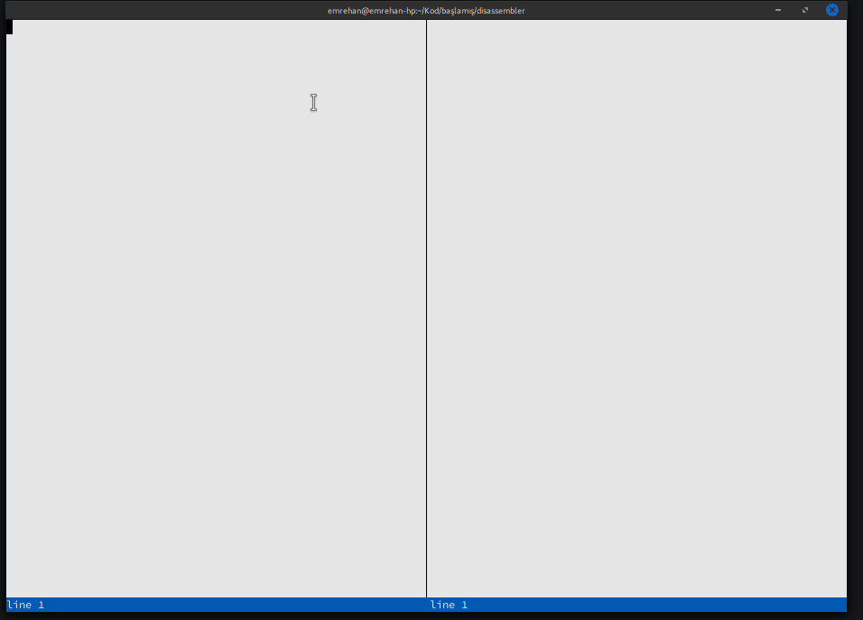

# Comparator

An extremely lightweight, terminal-based utility written in C that allows developers to visually compare C source code side-by-side with its compiled Assembly output. Built with `ncurses`, it provides a fast and responsive TUI (Text User Interface) for low-level code analysis and debugging.

## Features

* **Side-by-Side Comparison:** Instantly view your C code alongside its corresponding Assembly instructions.
* **Terminal-Based Interface:** Powered by standard `ncurses` and `panel` libraries, offering a clean, lightweight, and fast interface directly in your terminal.
* **Minimalist & Fast:** Written entirely in C with minimal dependencies. Leverages the custom `cstring` library for memory-safe and efficient string manipulation.
* **Dynamic Resizing:** Automatically adapts to terminal window dimensions using standard `ioctl` capabilities.

## Demo



## Prerequisites

To compile and run this project, ensure you have the following installed on your system:

* A C Compiler (e.g., `gcc`)
* `make`
* `ncurses` development headers (e.g., `libncurses5-dev` or `ncurses-devel`)
* `gcc`
* `objdump`
* `indent`
* `ncurses`

## Build & Installation

The project includes a minimal `Makefile` for immediate compilation without manual configuration.

1. Open your terminal in the project directory.
2. Compile the application by running:
   ```bash
   make

```

## Usage

Once compiled, an executable named `comparator` is generated. You can launch it directly:

## USAGE
1 - Write your c code on the left side
2 - Press ctrl+s, assembly or error printout now needs to be generated<br>
3 - Correct and try again if there is an error<br>
4 - Press ctrl+t and change window<br>
5 - scroll with the up and down keys and see the colorings<br>
6 - Press ctrl+q to exit<br>
<br>
Reminder, since the program is terminal based, use ctrl+shift+v to paste code
